_本文档提到的第三方文件均有备份，欢迎加QQ交流群免费获取文件或讨论使用相关问题：786214772_

---

## 1.安装PC端程序
### 1.1.一键安装
官方一键安装程序 slimevr_web_installer.exe [点击下载](https://github.com/SlimeVR/SlimeVR-Installer/releases/latest/download/slimevr_web_installer.exe)，它能够自动下载安装最新版本与依赖和驱动

（使用时请右键点击“以管理员身份运行”）

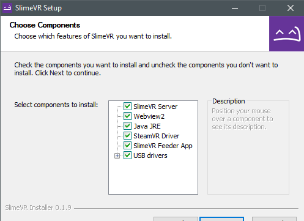

（图：全部安装即可）

注：**强烈建议**使用此方法安装，假如你尝试后发现过于缓慢或无法使用，请尝试改善网络环境、使用全局梯子代理/TUN模式等（尤其是大陆某些地区）。如果还是无法正常运行，可以按照最下方[ **5.1.手动安装步骤**]进行手动安装

安装后右键以管理员身份运行firewall.bat，防止程序通信被防火墙阻止

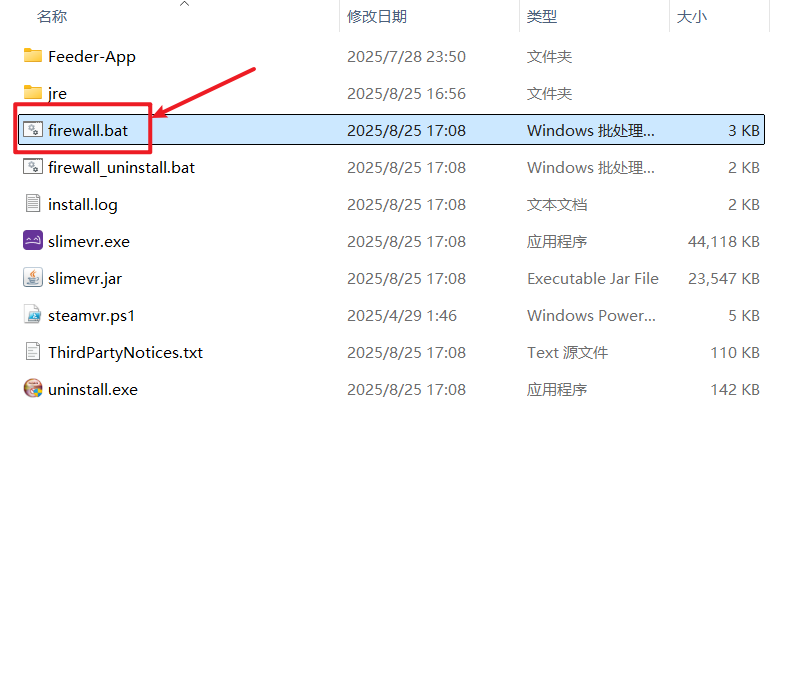

安装完成之后，运行slimevr.exe打开程序

（可以右键→创建快捷方式，将快捷方式移动到其他地方，不要直接拖走exe文件!!!）

---

## 2.环境初始化
### 2.1.网络环境要求
本Slime追踪器基于Esp-12f，它通过2.4G 频段的WIFI与你的电脑连接。

本文建议：

①电脑通过网线连接路由器，或者连接路由器的5G 频段 WIFI

②追踪器连接同一个路由器的2.4G 频段 WIFI

③路由器不建议开启双频合一模式，有些路由器可能内置“网络优选”或“智能分流”等功能，会导致连接问题

### 2.2.初始化SlimeVR Server
初次打开会有引导，如图所示，若软件不是中文可以在右下角切换中文

**<u>我们不需要跟着这个引导走，设置好语言后右上角ESC退出引导即可</u>**

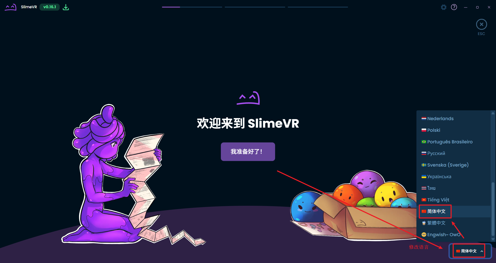

### 2.3.通过串口修改追踪器网络配置
①打开追踪器的开关

②将追踪器的Type-c口与电脑的USB口用数据线连接（有些数据线只有充电功能，请选择能传输数据的线）

③若正确安装了CH340驱动，此时会弹出窗口（如图），点击“连接到WI-FI”

④输入2.4G频段无线网的名称与密码，并点击提交

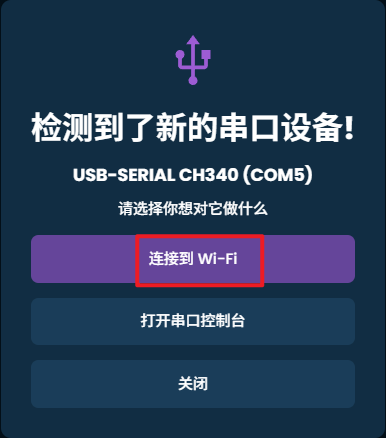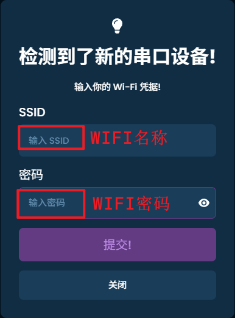

等待进度条完成（变绿）

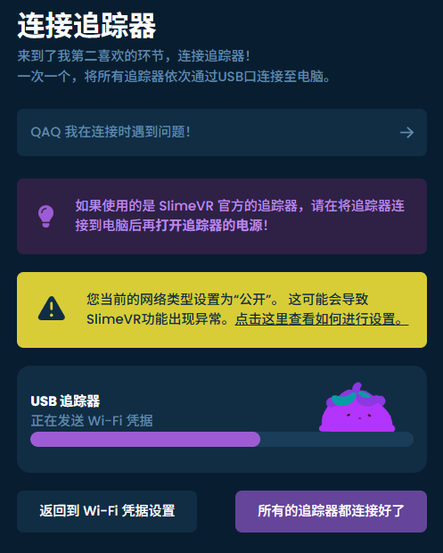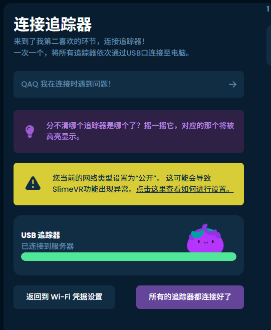

稍等片刻后，该追踪器会在右侧出现，此刻说明网络连接成功

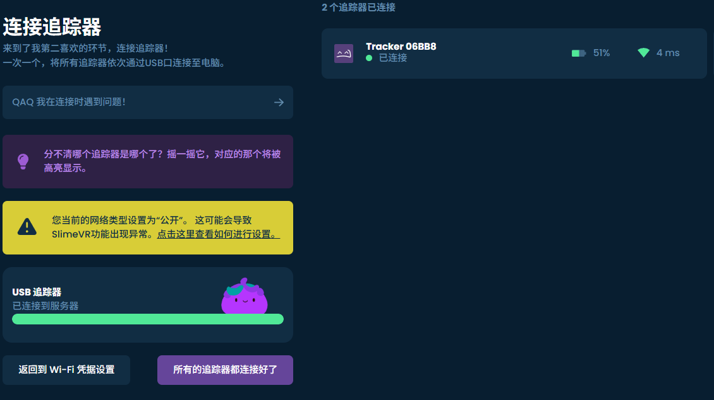

⑤拔下该追踪器，接入另一个追踪器，程序会自动为另一个追踪器接入WIFI

⑥全部追踪器均连接WIFI后，点击“所有的追踪器都连接好了”，至此WIFI配置完成

**常见问题：**

1. **无法连接到Wifi**

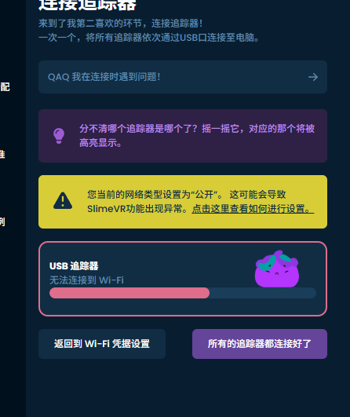

先尝试重启追踪器与SlimeVR客户端，重新拔插数据线，确认数据线能传输数据等

**检查网络状态：******

①网络配置是否输入正确（SSID与密码）

②填写的网络是否为2.4G频段

③路由器是否正常工作

2. **未找到服务器**

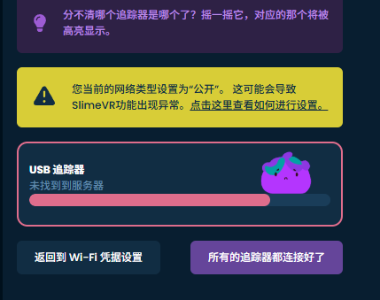

说明追踪器成功连接到WIFI，但是该WIFI与电脑不处于同一个LAN（局域网）下。

首先重启追踪器与SlimeVR客户端

请检查是否连接了同一个路由器的网络，以及路由器是否处于 “双路由”或“ AP 隔离”模式  

验证是否为同一个LAN：查看网络IPv4信息，IP 192.168.x.xxx 的前三组数字应一致

3. **未找到追踪器**

检查数据线是否有数据传输功能（有些数据线只有充电功能）

尝试把Type-c 头反过来重新尝试

---

## 3.初次使用说明
### 3.1.佩戴追踪器
#### 3.1.1.启动时校准
BNO_085款无需进行校准操作，打开即可使用；

其他款需要平放在平面上开机，同时保持静止15～20秒，**这一步很重要！校准操作会极大影响追踪效果。**

#### 3.1.2.佩戴方向
Type-C口朝上朝下均可，但**请保持所有追踪器上下朝向一致**

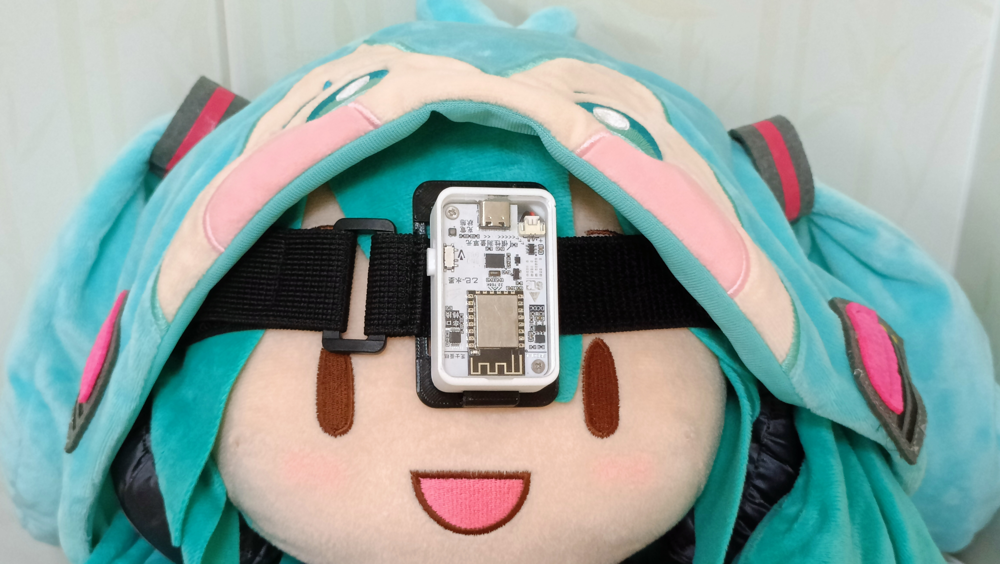

#### 3.1.3.佩戴位置
参考官方图片即可：

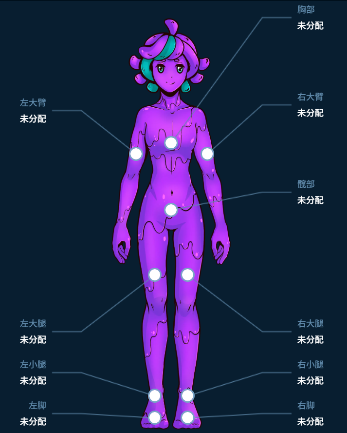

#### 3.1.4.注意事项
佩戴位置应该避开运动时容易受** 肌肉 **或** 衣服 **影响的身体部位，以下是一些例子：

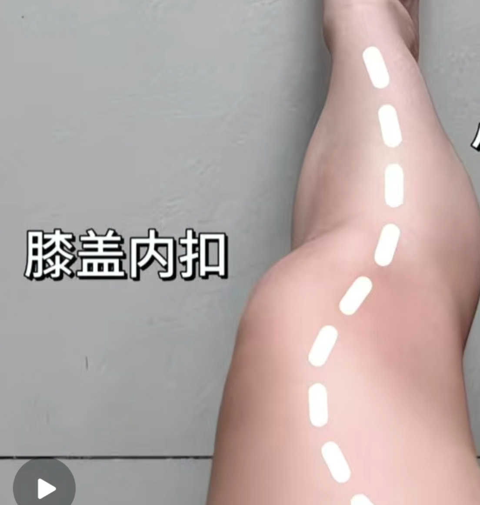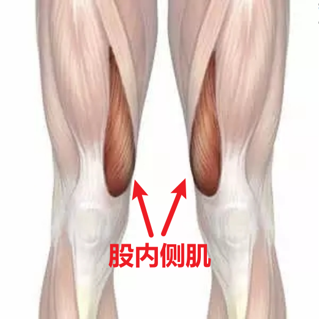

①部分朋友可能存在 **膝盖内扣 **或** 股内侧肌过于发达** 的腿型。

这可能会导致弯腿时，大腿点位的绑带被挤开，使虚拟角色的大腿在弯曲动作时发生X交叉/外翻。

请放置在平整、弯腿时不会较大变动的大腿表面（比如把佩戴位置放高一点），正面肌肉过多的情况下，可尝试放置在大腿外侧

②被肚子上的腹肌/肥肉挤开导致偏移

③脚底的绑带被地面摩擦导致偏移，请将绑带放置于脚底凹陷处

### 3.2.Slime Server 校准
#### 3.2.1.分配点位
将点位分配到不同的身体部位

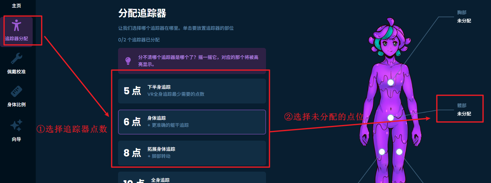

无法分清点位时，可以晃动追踪器寻找

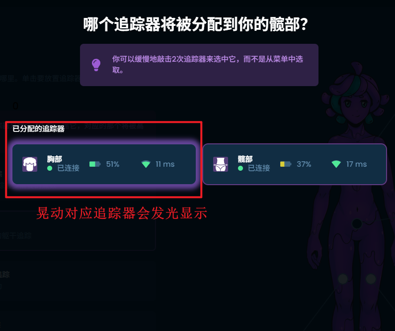

#### 3.2.2.佩戴校准
点击“自动设置佩戴方向”，跟随提示校准即可

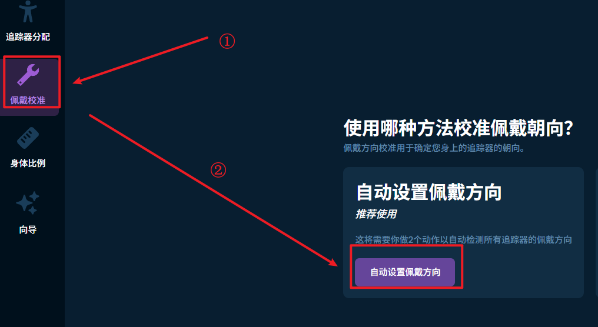

骨架可正常运动即校准完成

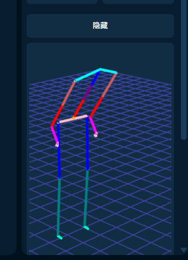

#### 3.2.3.关闭手势控制
建议关闭手势控制，或仅保留重置航向角。追踪器较为灵敏，容易误触这些动作，这会导致骨架错误地进行重置

如果你想知道重置功能具体有哪些，见下方 [**4.1. 重置功能**](#ayJUp)

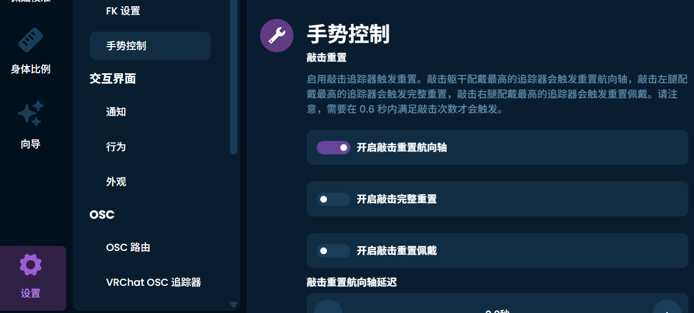

关于无VR头显模式，详见 [**4.5 无VR头显模式**](#eGiYp)

### 3.3.Vrchat 校准
#### 3.3.1.连接
启动SteamVR前，**<u>应先打开SlimeVR并连接好Slime追踪器</u>**

若SteamVR驱动已正常安装并启用，会显示Slime追踪器

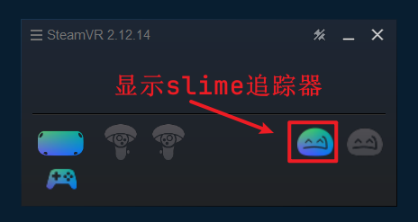

#### 3.3.2.修改Vrchat设置
按图中选项设置即可（VRC的更新可能导致UI位置有差异）

**小菜单设置：**

① 玩家身高：VR头显距离地面的高度，不是实际身高   

② 身体比例测量模式：选择身高

③ 锁定部位：平时推荐头部，跳舞时选腰部

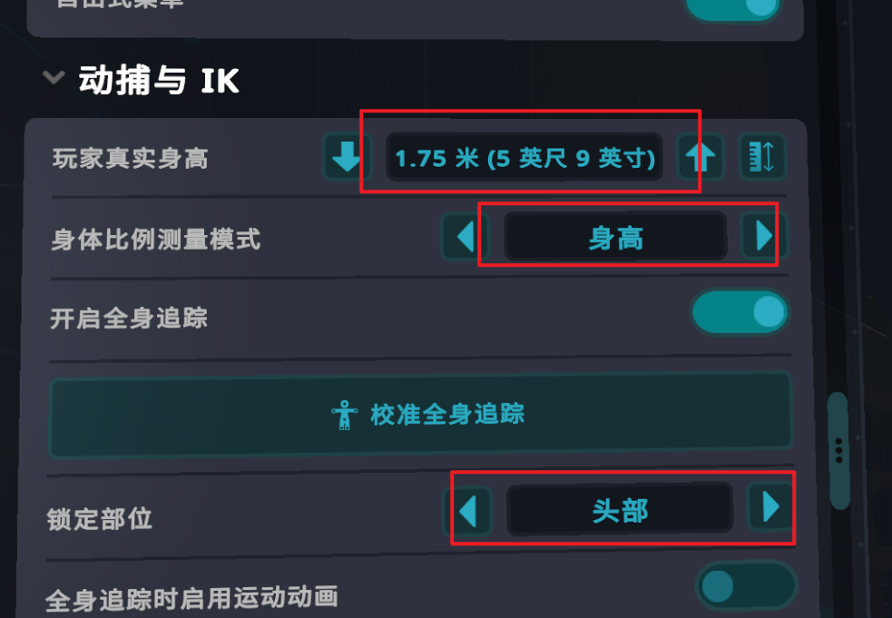

**大菜单设置：**

① 使用旧版IK算法：关闭

② 追踪器运动预测：90~100%

③ 显示全身校准视觉反馈：打开

④ 追踪器吸附范围：推荐0.20米

⑤ 追踪器显示外观： 方向轴

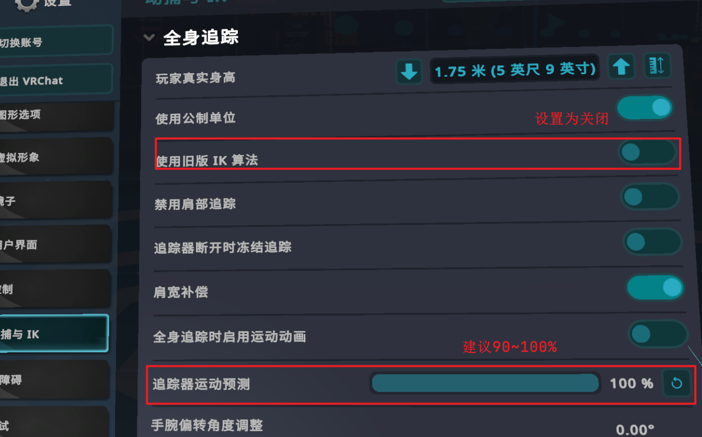

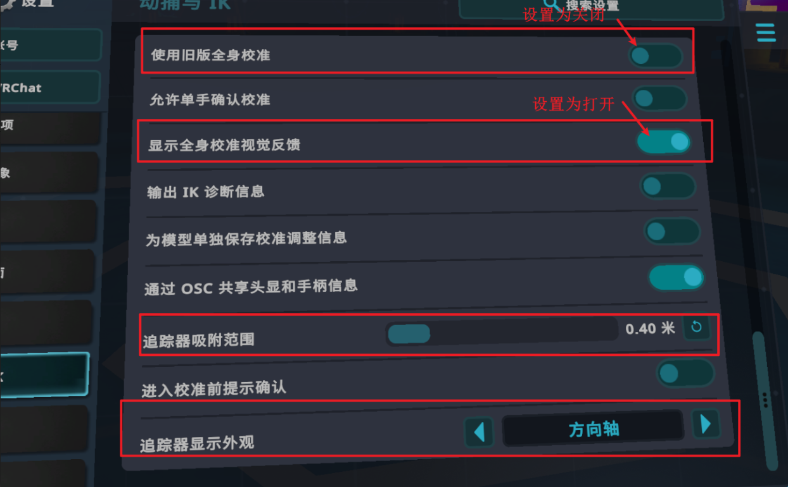

**镜子设置：**

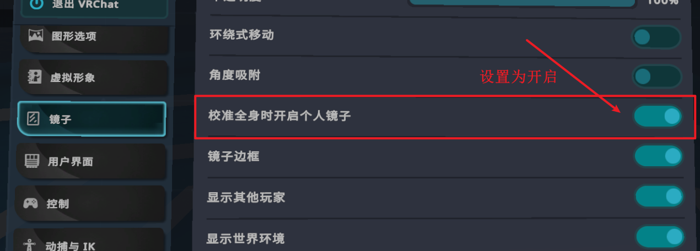

#### 3.3.3.校准
设置完成后，先在SlimeVR进行一次完整重置（需要站直并向前看），

完成后**不要移动双脚**，在小菜单点击“校准全身追踪”即可

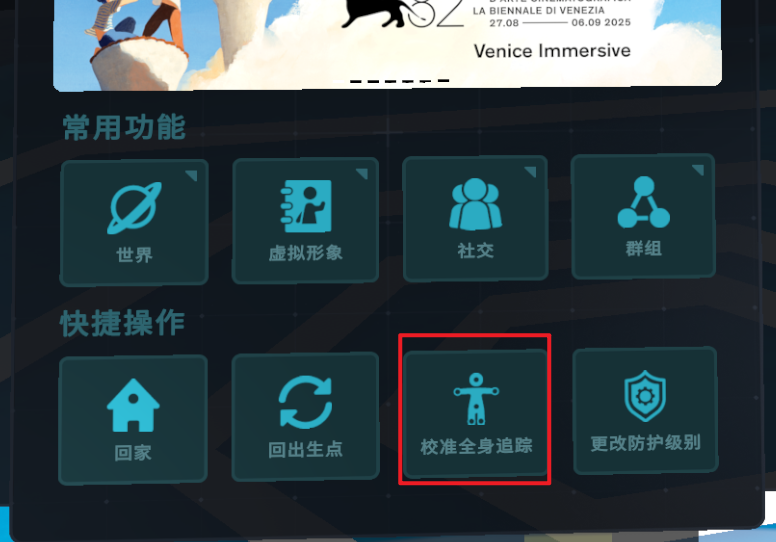

注意：

①十字轴方向应与肢体方向平行

②绿球和蓝色指示线是提示角色的关节，应指向最接近的追踪器

确认无误后，同时按左右手柄肩键完成校准

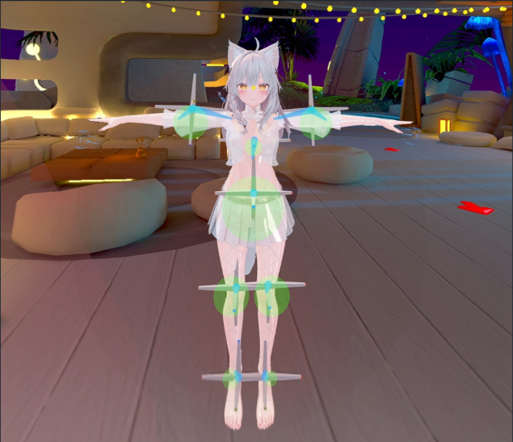

---

### 3.4.SlimeVR优化追踪效果
#### 3.4.1.调整骨架
SlimeVR预设的身体比例可能并不适配一些亚洲人的体型，可以通过调整使骨架更加适配自己的身体

对于跳舞用户来说，调节骨架与自身一致可以使动作效果更佳

①确认正确身高后进入手动调整

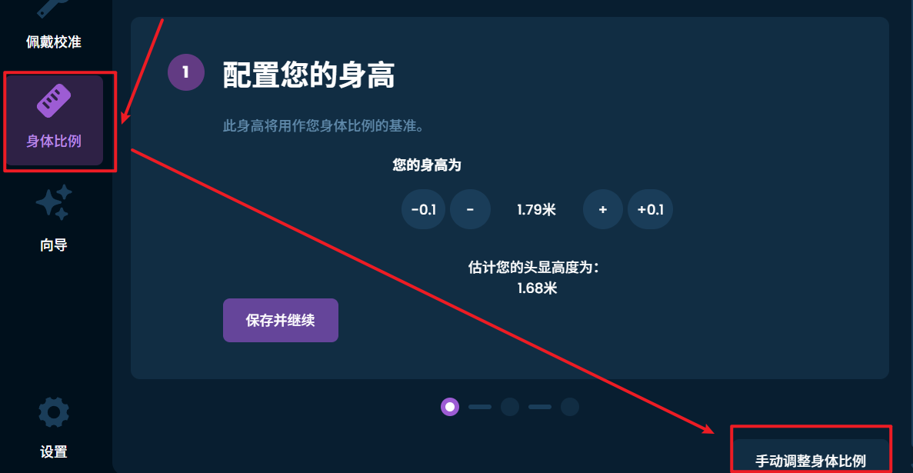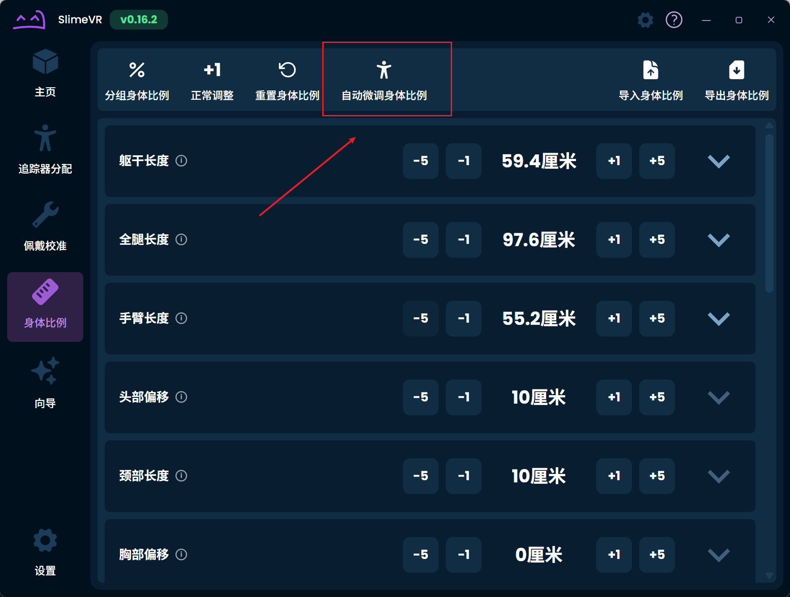

#### 3.4.2.滤波类型
选择平滑型以减少抖动，或选择预测型减少延迟

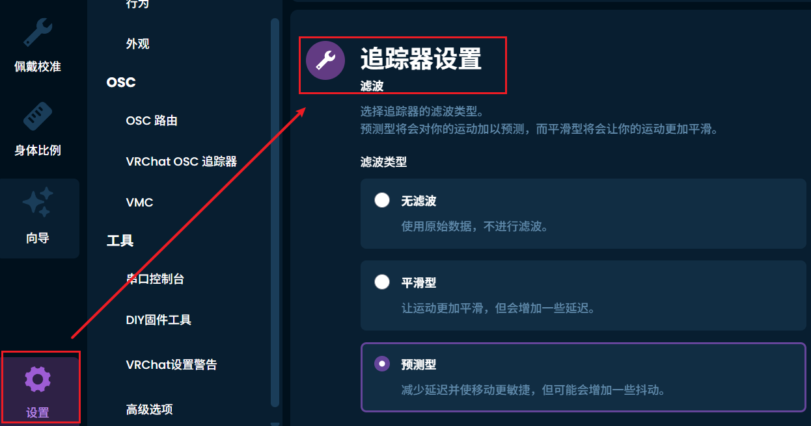

---

## 4.常见功能/问题说明
### 4.1.重置功能
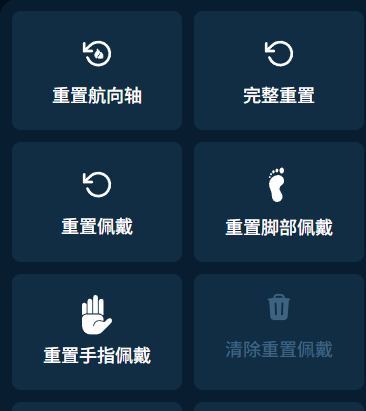

**追踪器**在相对较长的时间才会出现明显漂移，不需要频繁的重置追踪器，官方建议在 45-60 min 左右进行一次重置（进行跳舞等剧烈运动会导致更快的偏移，具体以环境和效果为准）

关于重置功能的说明：

1. **重置佩戴：**

用于校准追踪器的佩戴方向，需要以特定的姿势使用（详见 SlimeVR 自动设置佩戴方向的滑雪姿势）

2. **完整重置：**

用于将骨架恢复到默认姿势， 需要 <u>站直并向前看</u> 的姿势

3. **重置航向轴：**

用于清除角度偏移，需要 <u>伸直四肢并向前看</u> 的姿势，可以在坐/躺时使用

### 4.2.为什么腿伸不直/弯曲效果差？
说明：角色姿态通过头、腰、地面 这三个位置来确定，使用 <u>不符合玩家</u>**<u>现实身体比例</u>** 的模型会导致虚拟角色与真人姿态不一致。

如图，虚拟角色腿部比例比真人长时，会无法伸直：

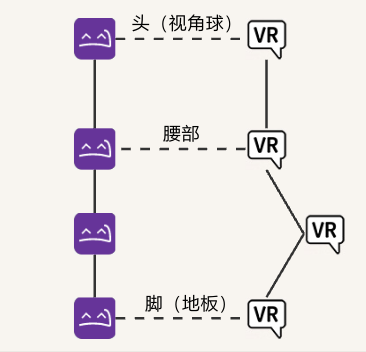

反之，虚拟角色腿部比例比真人短时，则不能很好的弯曲：

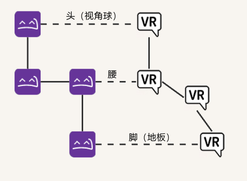

可以尝试调整大腿点位追踪器的佩戴高度来改善表现，但这是治标不治本的方法；

如果想实现更准确的姿态，需要使用与玩家个人身体比例较为接近的虚拟形象；

建议使用Blender/Unity等软件调整虚拟模型的身体比例来解决。

### 4.3.脚部追踪问题
使用脚部点位时出现 **现实中抬起脚背，模型的脚却向下运动 **的情况

可以分别尝试以下解决方法：

方法①：可能追踪器朝向有误，尝试更改追踪器type-c充电口的朝向

方法②：在佩戴重置时踮起脚尖（请借助墙壁等物体保持平衡，注意安全）

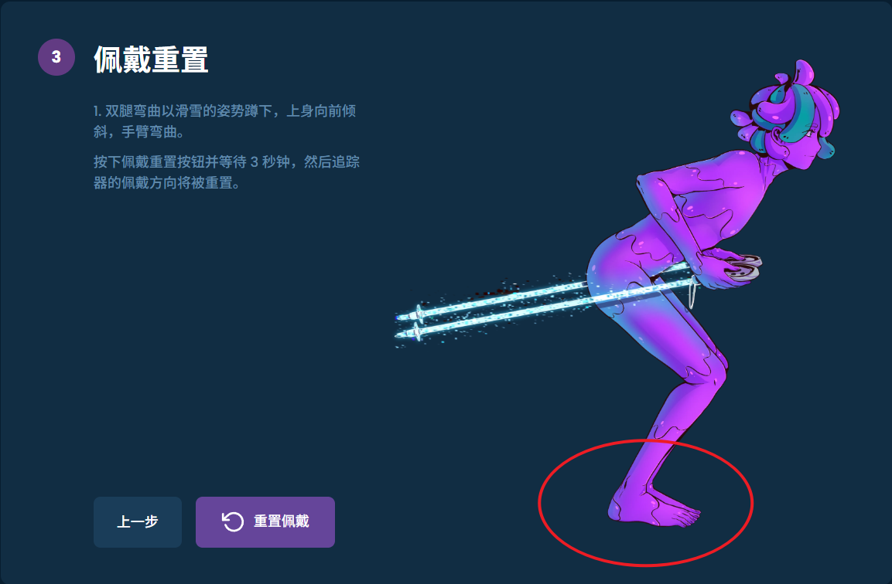

### 4.4.关于磁力计
BNO_085款追踪器默认使用6轴+ARVR稳定模式，其磁力计仅用于内部数据融合，在SlimeVR中保持关闭即可；

SlimeVR官方目前对磁力计的开发与使用非常有限，目前史莱姆的追踪效果基本与磁力计无关，需要等待SlimeVR官方进一步开发固件。

### 4.5.无VR头显模式
1. **打开开发者模式**

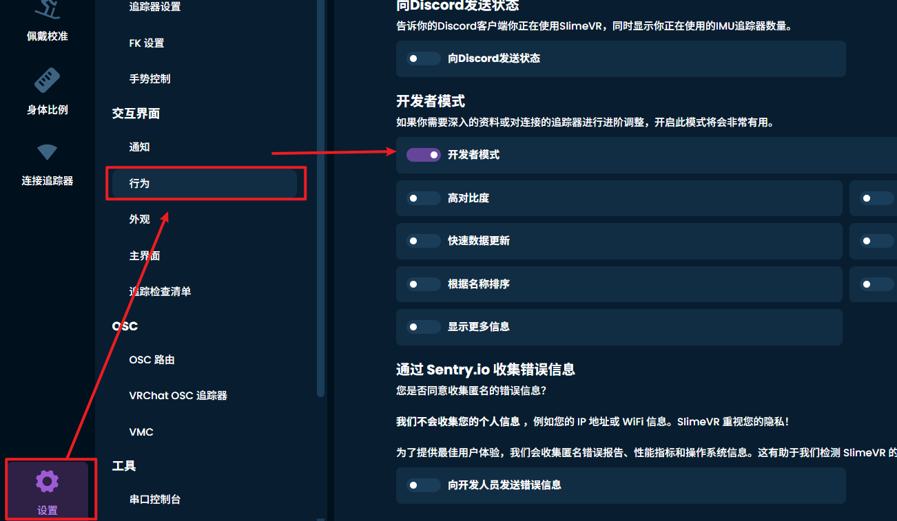

2. **打开动作捕捉模式**

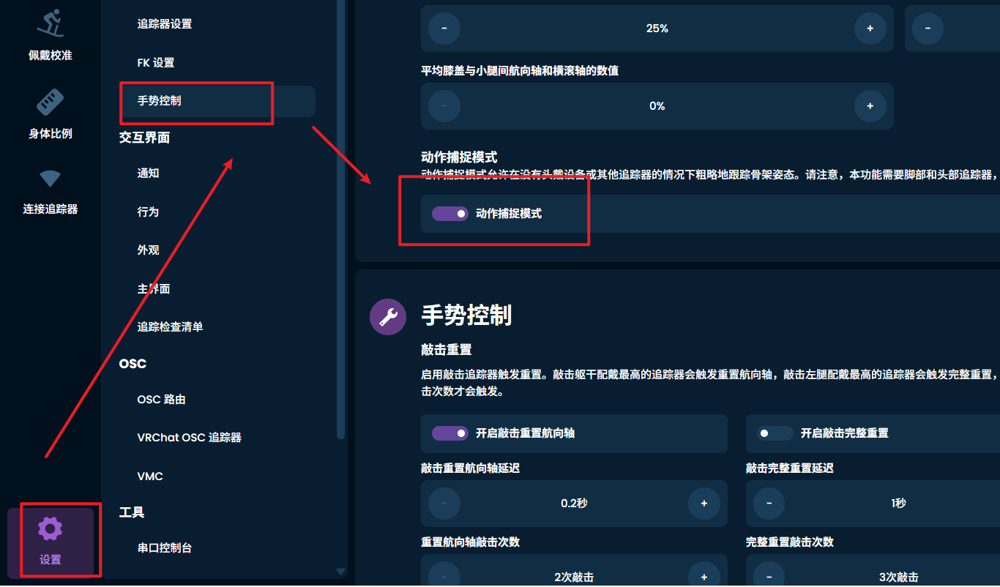

3. **注意事项：**

①由于没有来自头显的数据，追踪效果可能不如佩戴头显时的追踪效果优秀

②该模式强制要求在头部、脚部佩戴追踪器，故对点位数量需求更多

最低需求为8点：

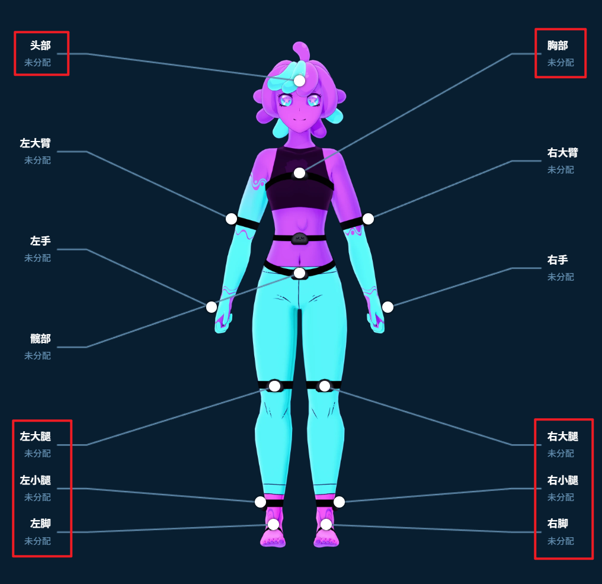

---

## 5.Extra
### 5.1.手动安装步骤
#### 5.1.1.下载SlimeVR Server
SlimeVR Server在Github上开源

在[官方仓库（点我）](https://github.com/SlimeVR/SlimeVR-Server/releases)选择符合自己系统的版本：

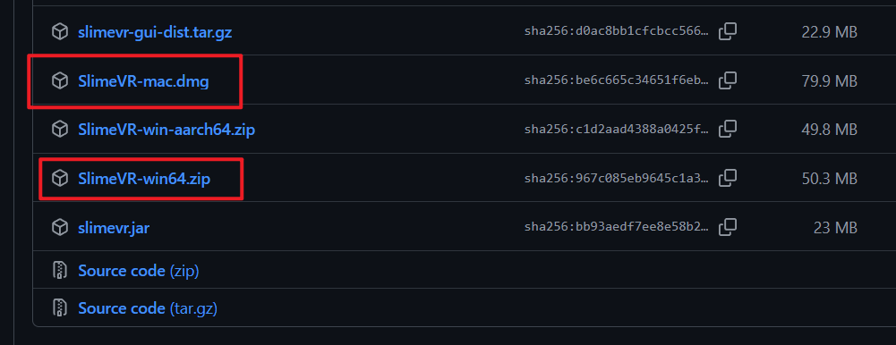

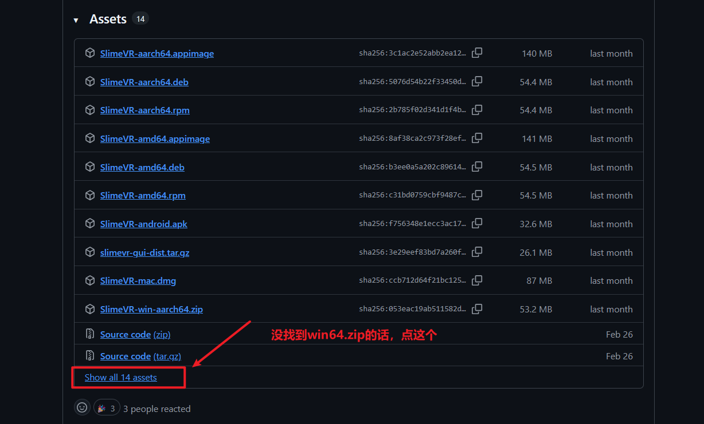

（windows用户选择win64.zip）

下载后解压，放在方便找到的目录

注：**SlimeVR的目录路径需要保持纯英文，中文路径可能会导致报错**

#### 5.1.2.下载SlimeVR Feeder App
[官方仓库（点我）](https://github.com/SlimeVR/SlimeVR-Feeder-App/releases/tag/v0.2.11)：

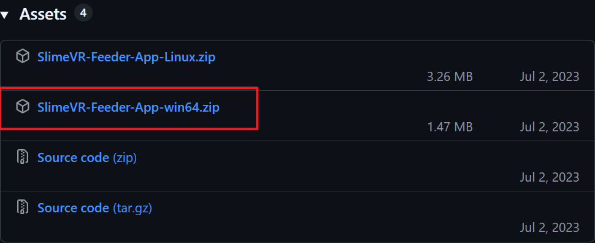

下载解压后放入SlimeVR Server文件夹：

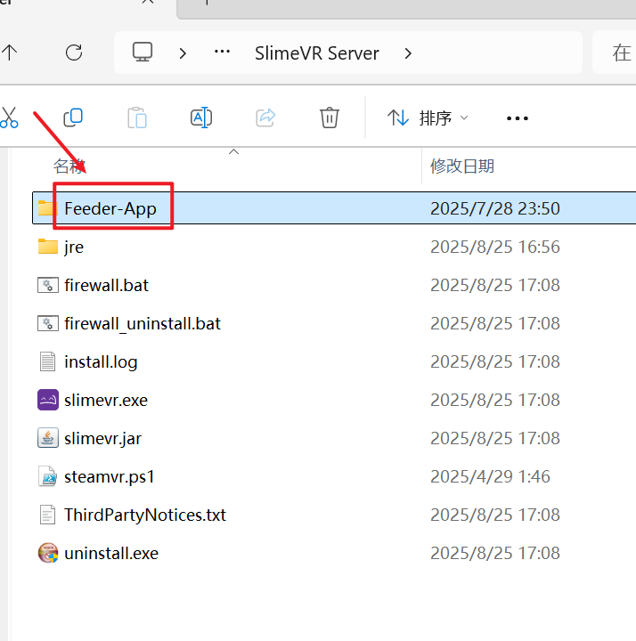

#### 5.1.3.下载Java
SlimeVR Server 基于Java11或更高的版本运行

本文推荐使用openjdk-Java17：[点击下载（来自华为开源镜像站）](https://mirrors.huaweicloud.com/openjdk/17/openjdk-17_windows-x64_bin.zip)

①下载完成后解压：

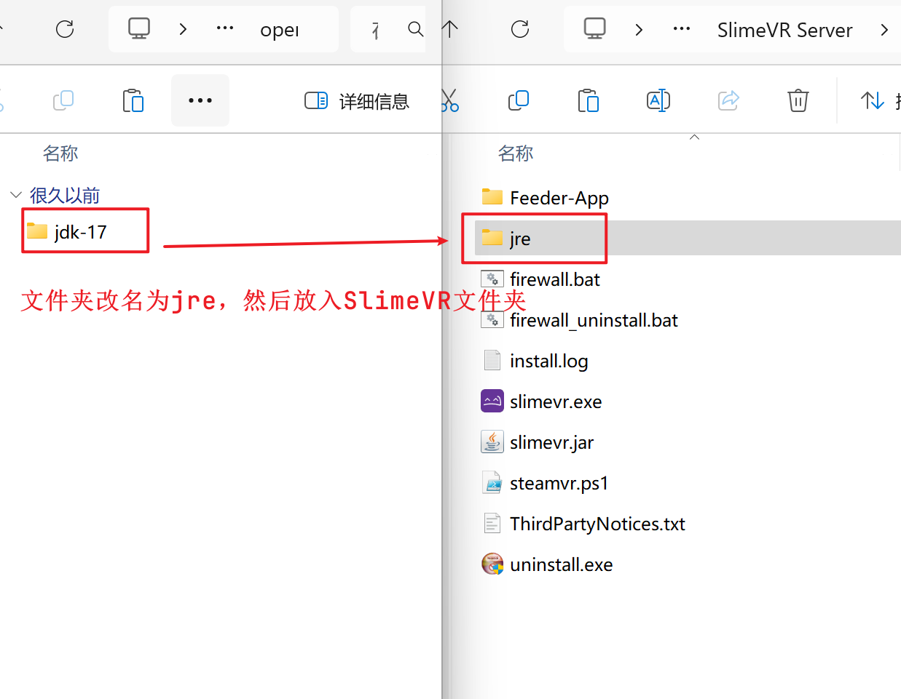

②右键以管理员权限运行firewall.bat，防止程序通信被防火墙阻止

此时，slimever.exe即可以正常打开并运行

#### 5.1.4.安装WebView2
部分电脑可能出现报错：WebView2 is missing / SlimeVR GUI crashes immediately 

这是因为缺少WebView2组件

可以在[微软官网（点我）](https://developer.microsoft.com/zh-cn/microsoft-edge/webview2/consumer)下载并安装

#### 5.1.5.安装ch340串口驱动
本方案的Slime追踪器通过CH340X进行串口数据转换，因此需要对应的串口驱动。

驱动不安装的情况下将：

①无法通过串口重新烧录或更新固件

②无法通过串口更改追踪器接入的网络

[驱动官方下载（南京沁恒）](https://www.wch.cn/downloads/ch341ser_exe.html)

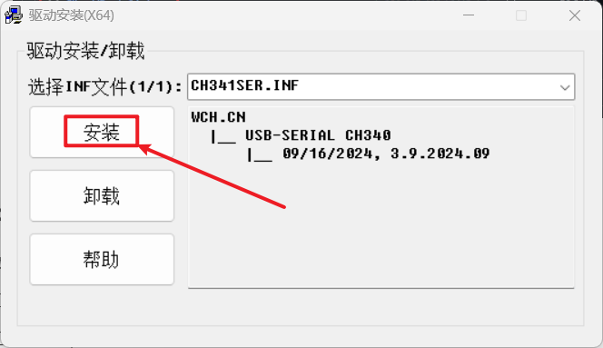

（图：安装界面）

#### 5.1.6.安装SteamVR驱动
需要对应驱动来让SlimeVR的追踪器数据能够被SteamVR读取到

①官方驱动仓库：[SlimeVR-OpenVR-Driver](https://github.com/SlimeVR/SlimeVR-OpenVR-Driver/releases/)

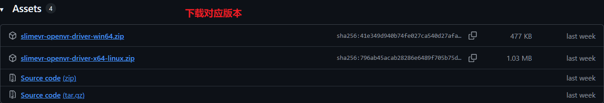

②打开SteamVR文件夹

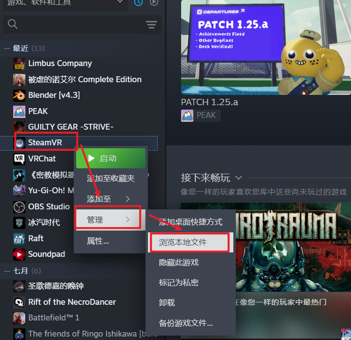

③将解压后的驱动放入SteamVR的驱动文件夹中

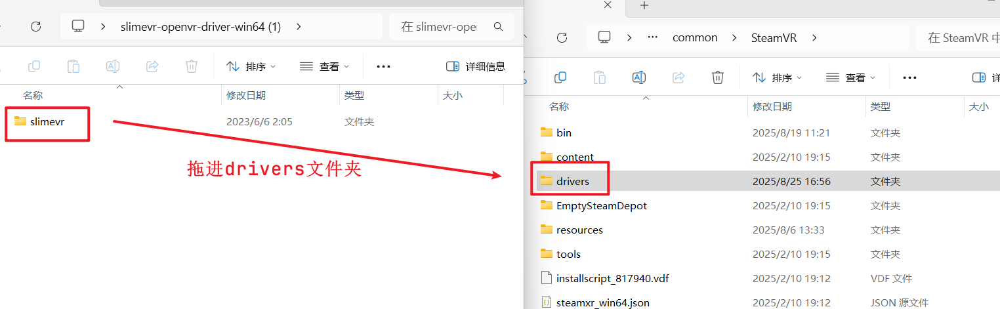

手动安装完成，可以返回页面顶端

---

### 5.2.通过串口更新追踪器固件（非必需）
_**<u>一般情况下，无需进行此步骤</u>**_

目前SlimeVR官方的ESP固件最新版本为v0.7.2，有更新的版本时可以自行更新

某些地区可能需要魔法

如图，进入DIY固件工具，并按红框提示进行配置：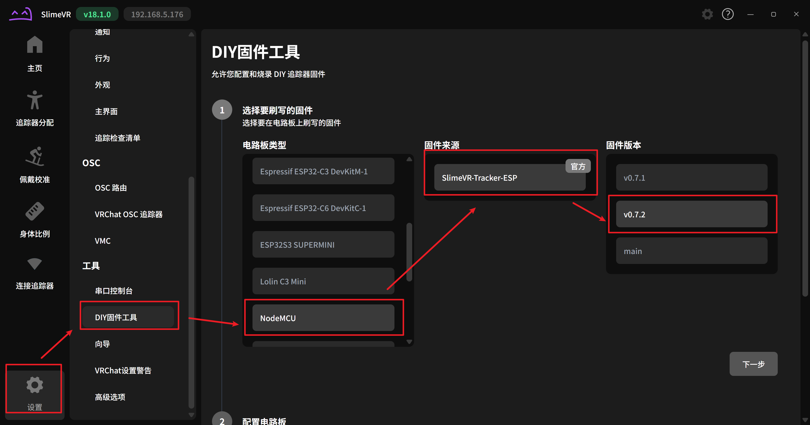

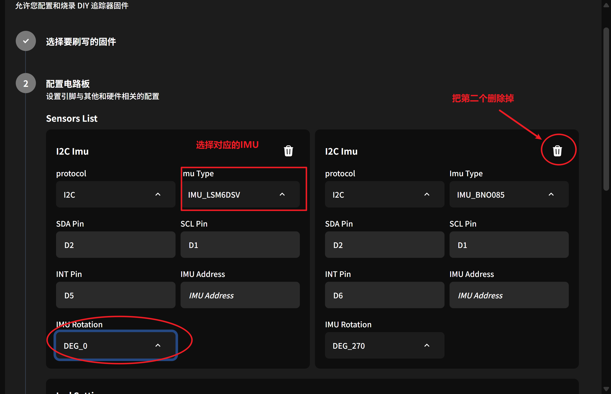

电量显示设置：

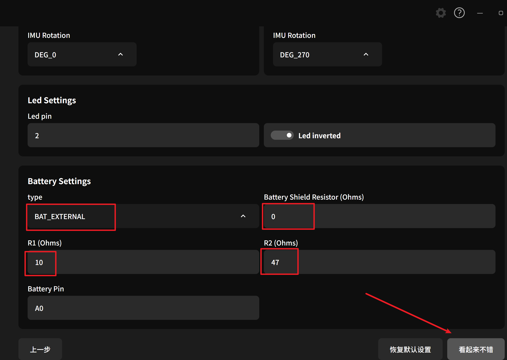

设置网络（使用你自己的网络名称与密码）：

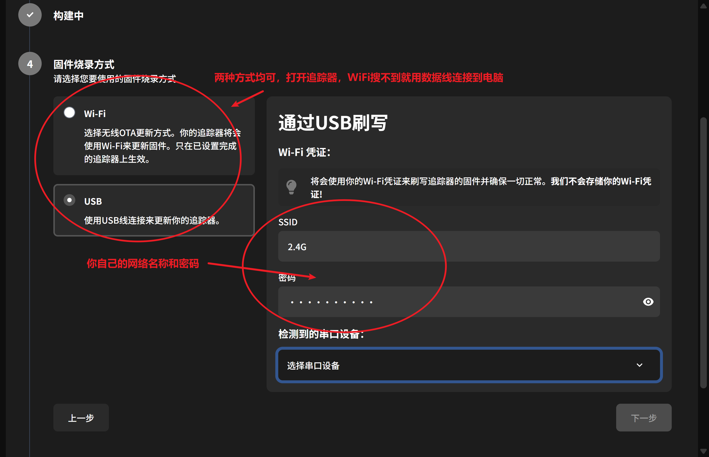

